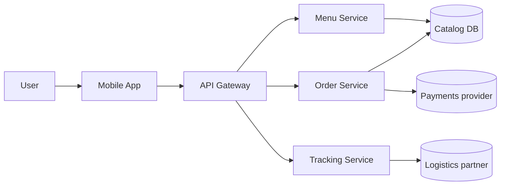

# SDD: FreshDesk

| Field | Value |
|---|---|
| Author | Architect |
| Status | Approved |
| Related PRD | 03-prd.md / 05-srs.md |
| Last updated | 2026-06-11 |

> Worked example — overview depth. Produced by `sdd-writer` (arc42-lite + C4). The plan to hit the SRS targets.

## 1. Context & constraints
FreshDesk app talks to: a Payments provider, a Logistics partner (live location), and our backend. Must meet SR-* targets (99.9% uptime, <1 s menu, 20k concurrent).

## 2. Architecture decisions
Significant decisions are recorded as ADRs — see `08-adr-0001-event-driven-tracking.md`. Summary: microservices for independent scaling; event-driven tracking; SQL for catalog/orders.

## 3. Building-block view (components)
| Component | Responsibility | Key interactions |
|---|---|---|
| Menu Service | Catalog + dietary filtering | Catalog DB |
| Order Service | Cart, payment orchestration, order state | Payments, DB |
| Tracking Service | Live location + ETA | Logistics feed (events) |

## 4. Runtime view (order + track)
User pays → Order Service confirms with Payments → emits `OrderPlaced` → Tracking Service subscribes and streams driver location to the app.

## Conceptual data model
Users, DietaryPreferences, Meals, Orders, OrderItems, Favorites.

## Non-functional design
Filtering cached per-preference for <200 ms re-render; stateless services behind the gateway for horizontal scale to 20k; tracking via async events to isolate logistics latency.

## Security considerations
OAuth2 + MFA at the gateway; payment data never touches our store (delegated to provider, PCI scope isolated).

## Requirements traceability
See `RTM.md`.
