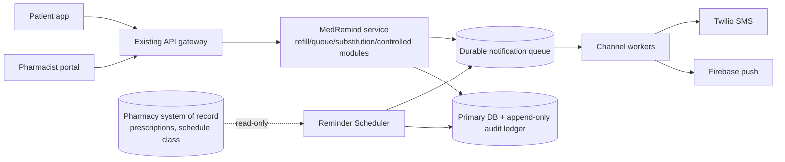
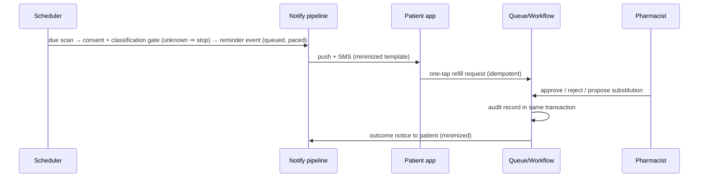

# SDD: MedRemind — Refill Reminder & Approval Module

| Field | Value |
|---|---|
| Author | sdd-writer (architect hat) |
| Status | Draft |
| Related docs | `04-prd.md`, `06-srs.md`, `brief.md` · RTM: [`RTM.md`](RTM.md) |
| Last updated | 2026-07-09 |

## Overview and goals
MedRemind extends the existing patient app and pharmacist portal with scheduled refill reminders (push + SMS), one-tap refill requests, a store-scoped approval queue with generic substitution, a fail-closed controlled-substance path, and an append-only audit ledger. Design drivers: the 17 SR-* constraints in `06-srs.md` (each addressed in §Non-functional design), HIPAA minimum-necessary, a 4-dev team, and a 3-sprint first slice.

## High-level architecture (SDD-ARC-001)
One **modular monolith service** behind the existing API gateway, plus an **async notification pipeline** (durable queue + channel workers). ≥2 stateless service instances behind a health-checked load balancer with a managed HA database; async decoupling keeps the 5-minute reminder SLA independent of provider latency and lets channel workers fail in isolation.

## Component breakdown
| ID | Component | Responsibility | Key interactions |
|---|---|---|---|
| SDD-REM-001 | Reminder Scheduler | Minute-tick scan for due prescriptions; consent + classification checks; emits reminder events | Rx system (read), Consent store, SDD-CTRL-001, queue |
| SDD-REM-002 | Catch-up Replayer | Persists last-fired watermark; on restart replays reminders missed during outage | Scheduler state, queue |
| SDD-NOT-001 | Notification Dispatcher | Channel workers consume queue; token-bucket pacing to Twilio cap; Twilio behind an adapter (BAA go-live gate) | Queue, Twilio, FCM |
| SDD-NOT-002 | Template Composer | Builds every SMS/push payload from the minimized template only (ASSUMPTION-10); no free-text path | Dispatcher; release-time content lint |
| SDD-NOT-003 | Delivery Tracker | Records provider accepted/failed status per send attempt via provider callbacks | Twilio/FCM webhooks, DB |
| SDD-REF-001 | Refill Request Service | One-tap request creation, idempotent (dedupe key = prescription + due cycle); retry-safe | Patient API, workflow, ledger |
| SDD-QUE-001 | Queue Read Model | Store-scoped, paginated, read-optimized projection of pending/awaiting/decided requests | Portal API, workflow events |
| SDD-SUB-001 | Decision & Substitution Workflow | State machine: Pending → Awaiting-patient → Approved/Rejected; dispensing blocked until substitution accepted; decline reverts to pharmacist with original medication | Queue, patient app, ledger, notifier |
| SDD-CTRL-001 | Classification Gate | Schedule II–V or **unknown ⇒ controlled (fails closed)**: no reminder, no one-tap | Scheduler, Refill Request Service |
| SDD-CTRL-002 | Verification Gate | Blocks controlled dispensing until an identity-verification record exists (method open — pluggable step) | Workflow, ledger |
| SDD-CTRL-003 | Pharmacist Contact | Controlled contact options rendered in portal only; no patient-facing prompt generated | Portal API |
| SDD-AUD-001 | Audit Ledger | Append-only records written in the same transaction as the decision/verification they record; no update/delete path exposed | All decision/verification writes |
| SDD-AUD-002 | Audit Query & Retention | Indexed query by request ID, pharmacist ID, date range; ≥6-year retention via archive tier | Portal/compliance API |
| SDD-SEC-001 | Identity & Session | Existing IdPs; individual pharmacist accounts; decision endpoints reject shared/service principals; 15-min idle timeout server-side | Gateway, portal |
| SDD-SEC-002 | Data Protection | TLS ≥1.2 on every interface; AES-256 at rest on all PHI stores incl. audit archive | All components |
| SDD-OBS-001 | Telemetry | Emits reminder-latency, queue-page-latency, availability SLIs | Scheduler, dispatcher, gateway |

## Data flow (primary: reminder → request → decision)

Unhappy:  one channel fails → other consented channel still fires; duplicate tap → dedupe key yields one request; unanswered substitution → request held visible as "awaiting patient"; controlled/unknown → flow stops at the gate, portal-only contact (SDD-CTRL-003).

## Conceptual data model
**Prescription** (external, read-only: due date, schedule class) — 1:N **ReminderSchedule** (next fire, watermark) and 1:N **RefillRequest** (state, store, dedupe key). RefillRequest — 0..1 **SubstitutionProposal** (proposed/accepted/declined) and 0..1 **VerificationRecord** (controlled only). **PatientConsent** (per-channel opt-in/out). **NotificationSend** (attempt, channel, provider status). **AuditRecord** (append-only; actor, action, request ref, timestamp).

## API / interface overview (logical; endpoint specs → TSD/api-designer)
| Interface | Consumer | Purpose |
|---|---|---|
| Patient API | Patient app | Request refill, respond to substitution, manage channel preferences |
| Portal API | Pharmacist portal | Store-scoped queue, approve/reject, propose substitution, record verification, controlled-contact options, audit query |
| Provider webhooks | Twilio/FCM | Delivery-status callbacks (SDD-NOT-003) |
| Rx read interface | Scheduler | Read-only prescription/classification data (ASSUMPTION-6, unverified — no recon ran) |

## Non-functional design — how every SR- constraint is met
| SR | Design decision |
|---|---|
| SR-PERF-001 | Minute-tick scheduler + durable queue + horizontally scalable workers: fire→provider-handoff budget ≪300 s; latency SLI (SDD-OBS-001) proves ≥99%/month (SDD-REM-001, SDD-NOT-001) |
| SR-PERF-002 | Store-scoped pre-computed read model with pagination — no cross-store scan at read time — sized for p95 <2 s @500 sessions (SDD-QUE-001) |
| SR-PERF-003 | 40k/day (ASSUMPTION-17) ≈ <1/s sustained; queue absorbs the 09:00 batch spike (ASSUMPTION-14) and workers scale out without breaching SR-PERF-001 (SDD-NOT-001) |
| SR-AVL-001 | ≥2 stateless instances, health-checked LB, managed HA database; no single point in request/queue path (SDD-ARC-001) |
| SR-AVL-002 | Persistent last-fired watermark; restart replays the missed window within 30 min (SDD-REM-002) |
| SR-SEC-001 | TLS ≥1.2 mandated on app, portal, Twilio, FCM, and Rx interfaces (SDD-SEC-002) |
| SR-SEC-002 | AES-256 at rest for every PHI store including ledger archive (SDD-SEC-002) |
| SR-SEC-003 | Store affiliation carried in the authenticated session; queue queries filtered server-side — 0 cross-store rows (SDD-QUE-001, SDD-SEC-001) |
| SR-SEC-004 | Decision endpoints require an individual interactive pharmacist identity; shared/service principals rejected (SDD-SEC-001) |
| SR-SEC-005 | Server-side 15-min idle session termination (ASSUMPTION-20) (SDD-SEC-001) |
| SR-PHI-001 | Single composer path from the minimized template; no free-text field can reach a payload; release content-lint + send-log sampling (SDD-NOT-002) |
| SR-PHI-002 | Twilio isolated behind an adapter; executed BAA is a go-live gate owned by release-manager/PM (SDD-NOT-001) |
| SR-INT-001 | Token-bucket pacing at the account MPS cap; excess remains queued, never dropped (SDD-NOT-001) |
| SR-INT-002 | FCM payloads are composer output only — structurally PHI-free, no BAA relied on (SDD-NOT-002) |
| SR-INT-003 | NotificationSend row per attempt, updated from provider callbacks (SDD-NOT-003) |
| SR-AUD-001 | Ledger exposes insert-only; no update/delete in any application or API path (SDD-AUD-001) |
| SR-AUD-002 | Audit write committed in the same DB transaction as the decision/verification event (SDD-AUD-001) |
| SR-AUD-003 | ≥6-year retention (ASSUMPTION-21) via archive tier, encrypted (SDD-AUD-002) |
| SR-AUD-004 | Ledger indexed on request ID, pharmacist ID, timestamp for full-recall query (SDD-AUD-002) |
| SR-OBS-001 | Three SLIs (reminder latency, queue p95, availability) live at go-live, dashboards for monthly evaluation (SDD-OBS-001) |

## Security considerations
Trust boundaries: patient app / portal → gateway (authn); service → Twilio/FCM (PHI-minimized egress only); service → Rx system (read-only). Spoofing: individual IdP accounts both surfaces. Tampering/repudiation: same-transaction append-only ledger. Info disclosure: template-only composition, store-scoped queries, TLS/AES-256. DoS: provider pacing + queue backpressure. Elevation: decision + verification actions gated on pharmacist role; unknown classification fails closed (ASSUMPTION-9). Full STRIDE pass → `security-reviewer` (downstream).

## Key trade-offs and decisions (ADRs via adr-writer)
| Decision | Chosen | Rejected | Rationale |
|---|---|---|---|
| Service shape | Modular monolith + async workers | Microservices per flow | 4 devs, 3 sprints; module boundaries preserve later extraction |
| Notification sends | Durable queue, async | Synchronous in-request send | Isolates 5-min SLA from provider latency; enables pacing (SR-INT-001) and replay (SR-AVL-002) |
| Audit placement | Ledger table in primary DB, same transaction | Separate log store/event stream | SR-AUD-002 atomicity is trivial in one DB; a stream adds a dual-write gap |
| Queue reads | Read-model projection | Direct joined queries | Meets p95 <2 s @500 concurrent without contending with writes |

## Requirements traceability
SDD IDs appended to the "Design (SDD/TSD)" RTM column this pass. PRD→SDD: PRD-REM-001/002/003 → SDD-REM-001/002, SDD-NOT-001/002/003, SDD-CTRL-001; PRD-REF-001 → SDD-REF-001; PRD-QUE-001 → SDD-QUE-001, SDD-SEC-001; PRD-QUE-002 → SDD-SUB-001, SDD-AUD-001/002, SDD-SEC-001; PRD-SUB-001/002 → SDD-SUB-001, SDD-AUD-001; PRD-CTRL-001 → SDD-CTRL-001; PRD-CTRL-002 → SDD-CTRL-002, SDD-AUD-001; PRD-CTRL-003 → SDD-CTRL-003; PRD-PHI-001 → SDD-NOT-002, SDD-SEC-002.

## Assumptions (practice 8 — tagged, unratified)
Carried: ASSUMPTION-6 (Rx/classification data reliable — **unverified: no solution-recon ran**), -7, -9, -10, -14, -16..21 as scoped in `06-srs.md`. New: **ASSUMPTION-22** — existing gateway/IdP supports individual pharmacist accounts and a configurable 15-min idle timeout; if not, SDD-SEC-001 grows an identity workstream (owner: architect, verify before sprint commit).

## Open questions
| Question | Owner | Decision | Date |
|---|---|---|---|
| Schedule II–V verification method — SDD-CTRL-002 is a pluggable gate; method choice may add a component | Compliance/architect | Open (carried) | 2026-07-09 |
| Confirm ASSUMPTION-22 (IdP capability) and ledger archive tier location before TSD | Architect | Open | 2026-07-09 |
