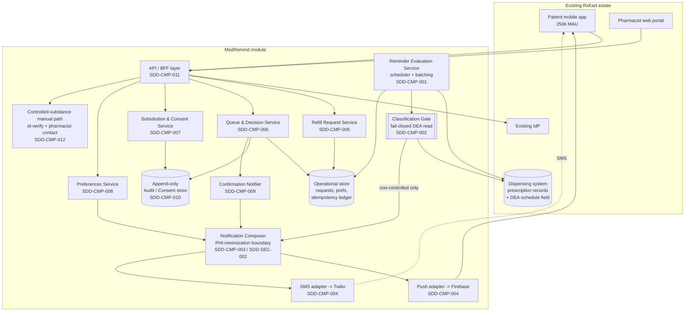
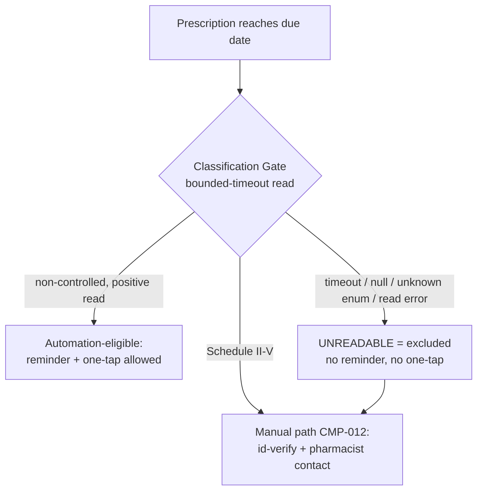
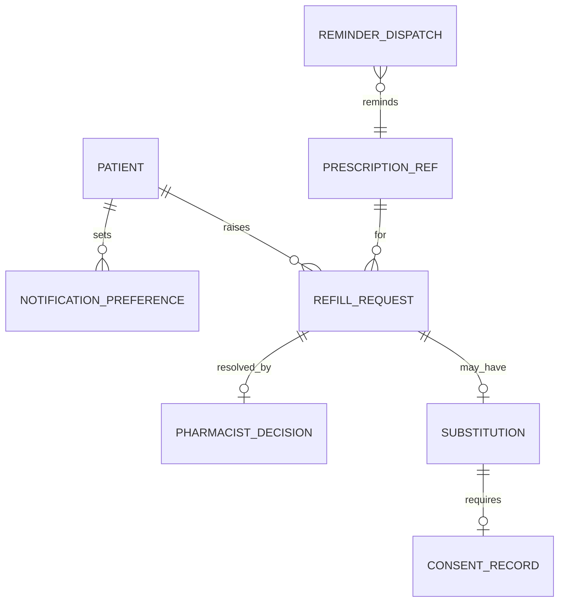

# SDD: MedRemind — Prescription Refill Reminder & Approval Module

*Author: `sdd-writer` (software architect) · phase: design · 2026-07-09 · run3*
*Upstream: `srs-writer` (`06-srs.md`), `frd-writer` (`05-frd.md`), `prd-writer` (`04-prd.md`), `urs-writer` (`03-urs.md`). Source of truth for scope: `brief.md`.*
*Downstream: `backlog-manager`, `adr-writer`, `api-designer`, `data-modeler`, `tsd-writer`, `security-reviewer`, `sre`, `architect`. RTM: `examples/medremind-fleet-eval/run3/RTM.md`.*

| Field | Value |
|---|---|
| Author | `sdd-writer` (software architect) |
| Status | Draft |
| Related PRD / FRD / SRS | `04-prd.md`, `05-frd.md`, `06-srs.md` |
| Altitude | High-Level Design (HLD) + selected LLD boundaries. Concrete tech versions, endpoint specs, cipher suites, DB schemas → `tsd-writer` / `data-modeler` / `api-designer`. |
| Last updated | 2026-07-09 |

## Overview and goals

MedRemind is **not a new product** — it is a module that plugs into RxKart's existing platform (250k-MAU mobile app, pharmacist web portal, existing IdP, existing dispensing system). This SDD describes *how* the refill loop **remind → one-tap request → pharmacist triage/decision** is structured so that it satisfies the FRD's deterministic behavior and the SRS's measurable constraints, at architecture altitude.

Design goals, in priority order (from the PRD guardrails and SRS budgets):

1. **The compliance guardrails are structural, not procedural** — zero-PHI-exposure (SR-PRIV-001/-002) and the Schedule II–V exclusion (SR-SAF-001/-002, FRD-CTL) are enforced at a *single choke point* each, so no code path can bypass them.
2. **Fail closed on the controlled-substance read** (SR-SAF-001, FRD-CTL-003) — the automation-eligible state is reachable *only* by a positively-read non-controlled classification.
3. **At-most-once effect** across retries/failover for reminders and requests (SR-DAT-001), and exactly-one pharmacist decision under concurrency (SR-DAT-002).
4. **Redundant delivery** — push and SMS fail independently (SR-AVL-002) while still producing at most one logical reminder.
5. **Meet the NFR budgets** on the existing footprint: ≤5-min dispatch (SR-PERF-001), <2s queue @ 500 concurrent (SR-PERF-002), 99.9% store-hours availability (SR-AVL-001).
6. **Ship the 3-sprint vertical slice first** (BG-004, CON-5) without designing an architecture that blocks the deferred Should/Could stories.

Scope boundary carried from upstream: no payment, no courier logistics, no e-prescribing, no new auth platform, US-only (ASSUMPTION-1), HIPAA + DEA only — **not** Part 11/GxP (ASSUMPTION-3).

## Architecture decisions (summary index)

Each hard-to-reverse decision below should be promoted to a standalone ADR by `adr-writer` and linked here; this section is the index, not the full rationale.

| ID | Decision | Chosen approach | Rejected alternatives | Rationale |
|---|---|---|---|---|
| SDD-ARC-001 | Deployment shape | A **modular service** deployed alongside the existing RxKart platform, exposing a patient BFF surface and a pharmacist portal surface; internally split into a small set of collaborating services (evaluation, notification, request, queue) around a shared operational store. | (a) Full microservice fleet — rejected: team of 7, 3-sprint slice (CON-5); operational overhead unjustified at this scale. (b) In-app monolith bolted onto the existing app — rejected: the reminder evaluator is a scheduled/async workload with a different scaling and failure profile from request/response surfaces. | Smallest structure that lets the async reminder pipeline scale and fail in isolation from the synchronous request/queue surfaces, without a fleet's ops cost. |
| SDD-ARC-002 | Compliance choke points | **Two mandatory in-line gates** every automation path must pass: a **Classification Gate** (SDD-CMP-002) and a **PHI-Minimization Boundary** (SDD-SEC-002). No path to dispatch or to a one-tap affordance exists that does not traverse both. | Scattering the checks into each feature's business logic — rejected: a single missed check is a DEA or HIPAA violation (KPI-5), so the guard must be un-bypassable by construction, not by discipline. | Makes the two non-negotiable guardrails a property of the topology rather than of every developer remembering them. |
| SDD-ARC-003 | Reminder pipeline style | **Event-driven, idempotent dispatch**: the evaluator emits one *ReminderDue* event per patient-batch per cycle; a dispatcher fans it out to channel adapters, keyed by an idempotency ledger (prescription + refill-due cycle). | Synchronous per-prescription send inside the scheduler — rejected: couples channel latency/failure to the evaluation cycle and makes redundant-channel isolation (SR-AVL-002) and at-most-once (SR-DAT-001) hard to guarantee. | Decouples evaluation from delivery so a Twilio/Firebase failure is contained, retries are safe, and batching (FRD-RMD-002) is natural. |
| SDD-ARC-004 | Audit & consent persistence | An **append-only** audit/consent store, logically separate from mutable operational state, is the system of record for pharmacist decisions (SR-AUD-001) and substitution consent (SR-AUD-002). | Storing decisions as mutable columns on the request row — rejected: not tamper-evident, cannot satisfy attributable append-only retention (SR-AUD-003). | Attributable, timestamped, append-only is a hard compliance constraint; a separate write-once log is the cleanest structural guarantee. |

## High-level architecture

Narrative: The **existing app** and **existing portal** talk to MedRemind through a thin BFF/API layer that delegates authentication to the **existing IdP** (no new auth platform, SR-SEC-001). The **Reminder Evaluation Service** runs on a schedule, reads due prescriptions from the **existing dispensing system**, and — critically — passes every candidate through the **Classification Gate** before anything else. Only positively-non-controlled candidates become *ReminderDue* events; those flow through the **Notification Composer** (which strips PHI) to independent **Push (Firebase)** and **SMS (Twilio)** adapters. Patient taps resolve through the **Refill Request Service** into an operational store; pharmacists work them through the **Queue & Decision Service**, whose decisions and substitution consents land in the **append-only Audit/Consent Store**. A **Confirmation Notifier** closes the loop back to the patient.

### C4 L2 — Container / component view



*(L1 context is the "Existing RxKart estate" boundary vs. patient/pharmacist/compliance-officer actors; omitted as a separate diagram since the L2 shows the same externals. L4 code diagrams are deferred — not essential at this altitude.)*

## Component breakdown (building-block view)

| Component | ID | Responsibility | Key interactions |
|---|---|---|---|
| Reminder Evaluation Service | SDD-CMP-001 | Scheduled evaluation of due prescriptions; applies the eligibility predicate (active ∧ non-controlled ∧ refills-remaining ∧ due); batches a patient's same-window eligibles into one logical reminder; writes the idempotency ledger entry per prescription+cycle. | Reads dispensing system; **must** call Classification Gate; emits *ReminderDue*; writes ledger in OPS. |
| Classification Gate | SDD-CMP-002 | Single choke point that reads the authoritative DEA-schedule classification within a bounded timeout and returns exactly one of {non-controlled, controlled, unreadable}. **Unreadable ⇒ excluded** (fail closed). Never returns "eligible" as a default. | Reads the dispensing prescription record (ASSUMPTION-9 field); gates SDD-CMP-001 and the one-tap affordance in SDD-CMP-005. |
| Notification Composer | SDD-CMP-003 | Builds channel payloads from *neutral copy + deep link only*; the PHI-minimization boundary — no drug name (or other PHI) crosses into any outbound payload field. Serves reminders, rejection notices, and approval/ready confirmations. | Consumes *ReminderDue* and confirmation events; honors preferences (SDD-CMP-008); feeds channel adapters. |
| Channel Dispatch (Push + SMS adapters) | SDD-CMP-004 | Two independent adapters (Firebase push, Twilio SMS) that dispatch a composed payload and report per-channel outcome; a failure of one does not affect the other and does not create a duplicate logical reminder. | Firebase / Twilio (CON-1); emit delivery metrics to observability. |
| Refill Request Service | SDD-CMP-005 | Creates a refill request from a single confirm action (no second-screen form); performs a **tap-time re-check** of eligibility (re-invokes the Classification Gate + refills/expiry); enforces idempotency per prescription+cycle; renders "request received". | BFF (patient); Classification Gate; OPS; feeds the queue. |
| Queue & Decision Service | SDD-CMP-006 | Serves the prioritized pending queue (patient, prescription ref, request time) scoped to the pharmacist's store; records approve/reject decisions with **exactly-one-decision** concurrency control; enforces mandatory reject reason; renders explicit empty state; never surfaces a Schedule II–V one-tap request. | BFF (pharmacist); OPS (read model); AUD (write); triggers confirmation. |
| Substitution & Consent Service | SDD-CMP-007 | Attaches a pharmacist's suggested generic to a request; blocks dispensing until patient acceptance is recorded as consent; halts on decline/timeout and routes to pharmacist follow-up. | BFF; AUD (consent record); OPS. |
| Preferences Service | SDD-CMP-008 | Persists per-patient channel opt-out; the composer/dispatch consult it so a disabled channel is skipped and the setting survives cycles. | BFF; OPS; read by SDD-CMP-003/-004. |
| Confirmation Notifier | SDD-CMP-009 | On approval, emits a closing-the-loop "refill ready/approved" confirmation event (PHI-minimized via the composer). | Consumes approval from SDD-CMP-006; feeds SDD-CMP-003. |
| Audit / Consent Store | SDD-CMP-010 | Append-only, attributable, UTC-timestamped system of record for pharmacist decisions and substitution consents; retained per compliance period. | Written by SDD-CMP-006/-007; read by inspection/audit. |
| API / BFF layer | SDD-CMP-011 | Patient and pharmacist façades; delegates authN to the IdP; enforces role/scope authZ server-side (patient ⇒ own records; pharmacist ⇒ own store queue). | App, Portal, IdP; fronts REQ/QUE/SUB/PREF/CTL. |
| Controlled-substance manual path | SDD-CMP-012 | The *alternative* surface a Schedule II–V patient is routed to: identity verification (mandatory) then pharmacist-initiated contact — no automated fulfilment affordance anywhere on it. | BFF; IdP (id-verify step); does **not** touch the reminder/one-tap pipeline. |

## Data flow

### Runtime view — reminder → one-tap request → approval (happy path)

```mermaid
sequenceDiagram
  participant Sch as Evaluation Svc (CMP-001)
  participant Cls as Classification Gate (CMP-002)
  participant Cmp as Composer (CMP-003)
  participant Ch as Push/SMS (CMP-004)
  participant Pt as Patient app
  participant Req as Request Svc (CMP-005)
  participant Q as Queue/Decision (CMP-006)
  participant Aud as Audit store (CMP-010)
  participant Cfn as Confirmation (CMP-009)

  Sch->>Cls: classify(prescription)
  Cls-->>Sch: non-controlled (positive read)
  Note over Sch: batch patient eligibles; write idempotency ledger (prescription+cycle)
  Sch->>Cmp: ReminderDue(patientBatch)
  Cmp->>Ch: neutral payload + deep link (no drug name)
  Ch-->>Pt: push + SMS (redundant)
  Pt->>Req: tap "Request refill" + confirm (deep link)
  Req->>Cls: re-check eligibility at tap time
  Cls-->>Req: still eligible
  Note over Req: idempotent create (dedupe on prescription+cycle)
  Req-->>Pt: "request received"
  Req->>Q: enqueue pending request
  Q-->>Q: pharmacist opens store-scoped queue (<2s @500)
  Q->>Aud: append approve decision (pharmacist id + UTC ts)
  Q->>Cfn: approved
  Cfn->>Cmp: ready/approved confirmation (no drug name)
  Cmp-->>Pt: confirmation
```

### Runtime view — fail-closed classification (highest-risk path)



This diagram is the structural expression of SR-SAF-001/-002 and FRD-CTL-001/-003: there is no edge from *unreadable* to *automation-eligible*.

## Conceptual data model

Conceptual entities and relationships only — physical schema, indexes, and column types are `data-modeler`/`tsd-writer`-owned.



| Entity | ID | Nature | Notes |
|---|---|---|---|
| Prescription reference | SDD-DAT-000 | **External, read-only** | Owned by the dispensing system; MedRemind holds a reference + the read DEA-schedule classification (ASSUMPTION-9). MedRemind never originates prescriptions. |
| RefillRequest | SDD-DAT-001 | Operational, mutable state machine | States: *received → pending → {approved, rejected, substitution-pending} → closed*. Unique per (prescription, refill-due cycle) to enforce idempotency (SR-DAT-001, FRD-RFL-002). |
| PharmacistDecision | SDD-DAT-002 | **Append-only audit** | Attributable (pharmacist identity), UTC-timestamped; reject carries mandatory reason. Exactly one per request (SR-DAT-002, FRD-QUE-006). |
| SubstitutionConsent | SDD-DAT-003 | **Append-only consent** | Patient acceptance timestamp; dispensing precondition (SR-AUD-002, FRD-SUB-002). |
| NotificationPreference | SDD-DAT-004 | Operational | Per-patient channel opt-out; persisted across cycles (FRD-PRF-001). Granularity unratified (ASSUMPTION-11). |
| ReminderDispatch ledger | SDD-DAT-005 | Operational idempotency ledger | Key = prescription + refill-due cycle; the at-most-once guarantee's backing record (SR-DAT-001, FRD-RMD-006). |

## API / interface overview

Logical interfaces only — resource names and purpose, not final endpoint specs (those are `api-designer`/`tsd-writer`).

- **Patient BFF:** resolve reminder deep-link → prescription-eligibility view; create refill request (idempotent); read request status; read/update notification preferences; enter controlled-substance manual path.
- **Pharmacist BFF:** read store-scoped pending queue; submit decision (approve / reject-with-reason); attach substitution.
- **Internal:** Evaluation → Classification Gate (classify); Evaluation/Confirmation → Composer (compose+dispatch); Composer → channel adapters (send); Queue/Substitution → Audit store (append).
- **External (integration seams):** IdP (authN + Schedule II–V identity verification, ASSUMPTION-4); dispensing system (prescription + DEA-schedule read, ASSUMPTION-9); Firebase (push); Twilio (SMS) — all per CON-1.

## Non-functional design

| NFR (SRS) | Design element | ID | How the design meets it |
|---|---|---|---|
| Dispatch ≤5 min p99 (SR-PERF-001), batch cycle in window (SR-SCAL-003) | Async event-driven pipeline; evaluation cycle emits events and returns; dispatch is decoupled and horizontally scalable; measured to provider hand-off (ASSUMPTION-18). | SDD-NFR-001 | Evaluation is not blocked by channel latency; the ≤5-min budget is the evaluation→hand-off segment only. |
| Queue <2s p95 @ 500 concurrent (SR-PERF-002, SR-SCAL-002); ack <2s (SR-PERF-003) | A **read-optimized queue projection** (pre-computed pending view, indexed by store + priority key) separate from the write path; request-ack is a single idempotent write. | SDD-NFR-001 | Reads don't contend with decision writes; 40-store / 500-session concurrency served from the projection. Priority key TBD (ASSUMPTION-13). |
| 99.9% store-hours availability (SR-AVL-001); redundant channels (SR-AVL-002); RTO/RPO (SR-AVL-003) | Stateless request/queue services behind existing platform HA; dual independent channel adapters; idempotency ledger makes recovery replay-safe. | SDD-NFR-002 | Single-channel provider outage still delivers the other channel; replay after failover cannot double-send (SR-DAT-001). Store-hours window unratified (ASSUMPTION-16); RTO≤1h/RPO≤5min (ASSUMPTION-19). |
| Observability of the SLOs (SR-OBS-001/-002/-003) | Per-channel dispatch + delivery-outcome + latency metrics emitted by SDD-CMP-004; SLO-breach alerts; documented rollback/runbook for the notification pipeline. | SDD-NFR-003 | The pipeline is the riskiest surface, so its metrics are first-class; rollback path isolates a bad notification release. |

## Security considerations

| Concern | Design element | ID | Notes |
|---|---|---|---|
| AuthN / AuthZ | All access via BFF → existing IdP (no new platform); server-side role/scope enforcement: patient ⇒ own prescriptions/requests only; pharmacist ⇒ own store queue scope. | SDD-SEC-001 | SR-SEC-001/-002. Authorization is never client-trusted. |
| PHI-minimization boundary | The Notification Composer is the *only* component that produces outbound patient payloads, and it is constructed to carry **no PHI** — the notification body is neutral copy + an opaque deep link; drug/prescription detail is resolved **only inside the authenticated app** after IdP auth, never in the push preview or SMS body. Applies to reminders, rejections, and confirmations. | SDD-SEC-002 | SR-PRIV-001/-002, FRD-RMD-003/-004, FRD-QUE-005, FRD-CFN-001. The uncontrolled-environment threat (URS §3) is defeated by structure: PHI never leaves the authenticated boundary. |
| Encryption & trust boundaries | PHI encrypted in transit (TLS 1.2+) and at rest (AES-256 or equiv.); trust boundaries drawn at the BFF (external↔internal) and at each external seam (IdP, dispensing, Firebase, Twilio); US data residency. | SDD-SEC-003 | SR-SEC-004, SR-PRIV-003. Exact cipher suite + key management are security-review/TSD-owned (ASSUMPTION-20). |
| Controlled-substance safety | Identity verification mandatory before any Schedule II–V refill proceeds; the manual path (SDD-CMP-012) shares no code with the automated pipeline, so there is no reachable state that automates a controlled substance. | SDD-SEC-001, SDD-CMP-012 | SR-SEC-003, FRD-CTL-004, CON-3. |

**Threat notes (STRIDE-informed):** *Information disclosure* — mitigated structurally by SDD-SEC-002 (no PHI in notifications). *Tampering/Repudiation* — mitigated by the append-only attributable audit store (SDD-ARC-004). *Elevation of privilege* — mitigated by server-side store-scoped authZ (SDD-SEC-001). *Spoofing* — IdP-delegated auth (SDD-SEC-001). A full threat model is owned by `security-reviewer` (ASSUMPTION-2 borrowed craft).

## Reality-check loop (feedback upstream)

Designing this surfaced no *architecturally impossible* PRD/SRS requirement — the NFR budgets are achievable on the existing footprint with the decoupled pipeline. Two items are **design-blocked pending ratification**, not design flaws, and are flagged rather than silently absorbed:

- The Classification Gate (SDD-CMP-002) is fully specified in *behavior* but its concrete source-of-truth field, read mechanism, and timeout value depend on ASSUMPTION-9 — see FLAG(architect). The gate's fail-closed contract holds regardless of how that field is resolved.
- The queue priority key (ASSUMPTION-13) affects the read-projection index (SDD-NFR-001) but not the topology.

## Key trade-offs and decisions

| Decision | Chosen approach | Alternatives rejected | Rationale |
|---|---|---|---|
| Guardrails in topology vs. logic | Two mandatory in-line gates (SDD-ARC-002) | Per-feature checks | A missed check = KPI-5 violation; make it un-bypassable by construction. |
| Reminder pipeline | Event-driven + idempotency ledger (SDD-ARC-003) | Synchronous per-prescription send | Contains provider failure, enables safe retry + batching + channel redundancy. |
| Audit persistence | Separate append-only store (SDD-ARC-004) | Mutable columns on request | Tamper-evident, attributable, retention-ready. |
| PHI defense | Resolve PHI only inside the authenticated app (SDD-SEC-002) | Encrypt-but-include a reference token that maps to drug name in payload | Even an opaque token in an SMS is a smaller but real surface; carrying *nothing* is the strongest guarantee for the uncontrolled environment. |
| Deployment shape | Modular service on existing estate (SDD-ARC-001) | Microservice fleet | Team of 7 / 3-sprint slice; fleet ops cost unjustified. |

## Requirements traceability

Design elements → the SRS/FRD requirements they satisfy (rows also appended to `RTM.md`).

| SRS / FRD requirement | Addressed by (SDD) |
|---|---|
| SR-SAF-001, SR-SAF-002, FRD-CTL-001/-003 (fail-closed classification) | SDD-ARC-002, SDD-CMP-002, SDD-DAT-000 |
| FRD-CTL-002 (never one-tap a controlled) | SDD-CMP-002, SDD-CMP-005, SDD-CMP-006 |
| FRD-CTL-004, SR-SEC-003 (manual path + id-verify) | SDD-CMP-012, SDD-SEC-001 |
| SR-DAT-001, FRD-RMD-006, FRD-RFL-002, FRD-RMD-007 (at-most-once / idempotency) | SDD-ARC-003, SDD-CMP-001, SDD-CMP-005, SDD-DAT-005, SDD-DAT-001 |
| SR-DAT-002, FRD-QUE-006 (exactly-one decision) | SDD-CMP-006, SDD-DAT-002 |
| FRD-RMD-001 (eligibility predicate) | SDD-CMP-001, SDD-CMP-002 |
| FRD-RMD-002 (batching) | SDD-CMP-001 |
| SR-PRIV-001/-002, FRD-RMD-003/-004, FRD-QUE-005, FRD-CFN-001 (PHI minimization) | SDD-SEC-002, SDD-CMP-003 |
| SR-AVL-002, FRD-RMD-005/-007, CON-1 (redundant channels) | SDD-ARC-003, SDD-CMP-004, SDD-CMP-008 |
| FRD-RFL-001/-003/-004 (one-tap + tap-time re-check + received state) | SDD-CMP-005, SDD-CMP-011 |
| FRD-QUE-001/-002/-003 (prioritized, scoped, empty-state queue) | SDD-CMP-006, SDD-NFR-001, SDD-SEC-001 |
| FRD-QUE-004/-005, SR-AUD-001 (attributable decisions) | SDD-CMP-006, SDD-CMP-010, SDD-ARC-004, SDD-DAT-002 |
| FRD-SUB-001/-002/-003, SR-AUD-002 (substitution + consent) | SDD-CMP-007, SDD-CMP-010, SDD-DAT-003 |
| FRD-CFN-001, ASSUMPTION-12 (closing-the-loop confirmation) | SDD-CMP-009, SDD-CMP-003 |
| FRD-PRF-001, ASSUMPTION-11 (opt-out) | SDD-CMP-008, SDD-DAT-004 |
| SR-SEC-001/-002 (IdP + role/scope authZ) | SDD-SEC-001, SDD-CMP-011 |
| SR-SEC-004, SR-PRIV-003 (encryption + residency) | SDD-SEC-003 |
| SR-PERF-001/-003, SR-SCAL-001/-003 (dispatch + ack budgets) | SDD-NFR-001, SDD-ARC-003 |
| SR-PERF-002, SR-SCAL-002 (queue <2s @ 500) | SDD-NFR-001, SDD-CMP-006 |
| SR-AVL-001/-003 (availability + DR) | SDD-NFR-002 |
| SR-OBS-001/-002/-003 (observability) | SDD-NFR-003, SDD-CMP-004 |
| BG-004 / BR-007 (3-sprint slice shape) | SDD-ARC-001 |

## Assumptions

Carried from upstream (do not re-invent; not decided): **ASSUMPTION-9** (authoritative DEA-schedule classification source-of-truth field + read mechanism — owner architect / compliance officer; **this SDD's Classification Gate depends on it — see FLAG**), ASSUMPTION-1 (US-only), ASSUMPTION-3 (HIPAA+DEA, not Part 11/GxP), ASSUMPTION-4 (existing IdP), ASSUMPTION-11 (opt-out granularity), ASSUMPTION-12 (confirmation channel/copy), ASSUMPTION-13 (queue priority key), ASSUMPTION-14 (substitution window), ASSUMPTION-16 (store-hours window), ASSUMPTION-18 (dispatch measured to provider hand-off), ASSUMPTION-19 (p95 latency + RTO≤1h/RPO≤5min), ASSUMPTION-20 (cipher/key-management specifics), ASSUMPTION-2 (borrowed design/security/SRE craft). ASSUMPTION-5/-6/-7/-10/-15/-17 carried for chain integrity.

New in this SDD (unratified):

- **ASSUMPTION-21** *(owner: architect / `data-modeler`)* — MedRemind holds only a **reference** to the dispensing system's prescription record plus the read DEA-schedule classification; it does not replicate the prescription record. If the dispensing system cannot expose a low-latency read for the ≤5-min evaluation cycle (SR-PERF-001), a read-model/cache seam may be required — a TSD/architect decision, not assumed here.
- **ASSUMPTION-22** *(owner: `sre` / architect)* — The reminder-evaluation cadence (how often the scheduler wakes to catch due prescriptions within the ≤5-min budget) is assumed to be a short fixed interval comfortably inside the 5-min window; the exact cadence is a TSD/SRE decision.

## Open questions

| Question | Owner | Decision | Date |
|---|---|---|---|
| Concrete DEA-schedule source-of-truth field, read mechanism, timeout value on the dispensing record | architect / compliance officer | Open — ASSUMPTION-9 (see FLAG) | — |
| Queue priority key (oldest-first vs nearest-lapse) → read-projection index | PM / `ux-ui-designer` / architect | Open — ASSUMPTION-13 | — |
| Whether a dispensing-system read-model/cache seam is needed for the eval cycle | architect / `data-modeler` | Open — ASSUMPTION-21 | — |
| Scheduler cadence within the 5-min budget | `sre` / architect | Open — ASSUMPTION-22 | — |

## Requirement-quality note (29148/INCOSE lint justification)

SDD design-element IDs (SDD-ARC/-CMP/-DAT/-SEC/-NFR-*) describe *structure and responsibility*, not "the system shall" obligations — the FRD (`05-frd.md`) and SRS (`06-srs.md`) own the testable requirement statements this design satisfies. Where a component description uses `and` (e.g. "reads the classification and returns one of…", "push and SMS"), the conjunction names the *facets of one responsibility or one integration seam*, not two bundled obligations. All SDD IDs are atomic; no range shorthand is used. Any `validate_reqs.py` findings on non-SDD IDs appearing here are upstream FRD-*/SR-*/URS-*/PRD-* IDs *cited* in trace columns, owned by their authoring agents.

## Flags

```
FLAG(architect): The Classification Gate (SDD-CMP-002) and the fail-closed data model
(SDD-DAT-000) are fully specified in BEHAVIOR — read within a bounded timeout; timeout/null/
unknown-enum/error ⇒ unreadable ⇒ excluded; no default path to automation-eligible. But the
CONCRETE source-of-truth field on the dispensing-system prescription record, the read mechanism
(direct read vs. read-model/cache — ASSUMPTION-21), and the specific timeout value remain yours
to pin in the TSD (ASSUMPTION-9, owner architect / compliance officer). This continues the
architect FLAG chain from 03-urs.md §10 → 04-prd.md → 05-frd.md → 06-srs.md (SR-SAF-001 fixed the
constraint-level "readable-only-when"); the SDD fixes the topology (single un-bypassable gate).
No new dependency — mechanism is design/TSD-owned.
```

```
FLAG(solution-recon): The solution-recon-findings input listed in this agent's contract was NOT
found on disk and was not routed by build_context_pack.py for run3. This SDD proceeded without a
build-vs-buy / existing-asset reconnaissance. The design leans heavily on REUSING existing assets
(IdP, dispensing system, Firebase, Twilio, mobile app, portal) per the brief/PRD/SRS, so the
absence is low-risk here — but if a recon pass exists, its findings (e.g. a mandated internal
notification platform, or a constraint on reading the dispensing system) could revise SDD-ARC-001
and ASSUMPTION-21. Tracked as ASSUMPTION-21/-22 rather than invented.
```

```
FLAG(rfc-facilitator): The RFC input listed in this agent's contract was NOT found on disk / not
routed for run3. No cross-team architectural RFC was consulted. The hard-to-reverse decisions
here (SDD-ARC-001, SDD-ARC-002, SDD-ARC-003, SDD-ARC-004) are candidates for ADRs via adr-writer; if an RFC process governs them at
RxKart, these should be RFC'd before ratification. Proceeded on the brief as source of truth.
```
