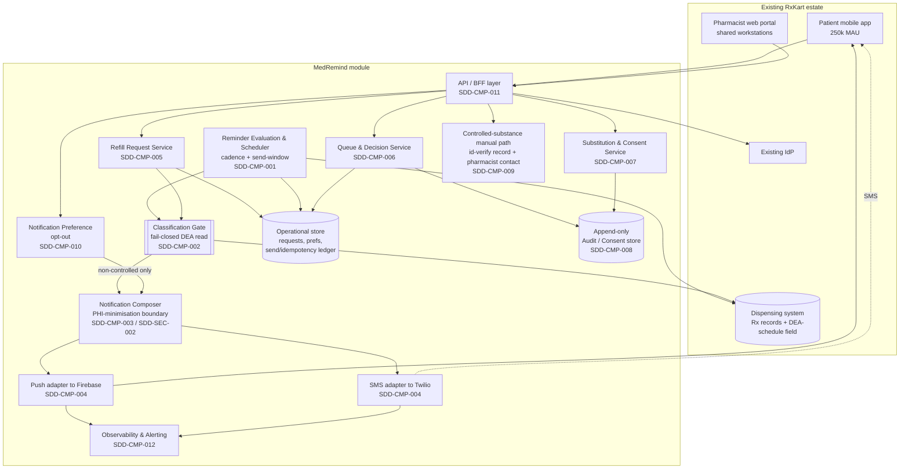
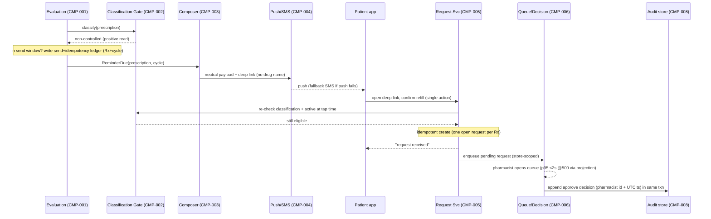
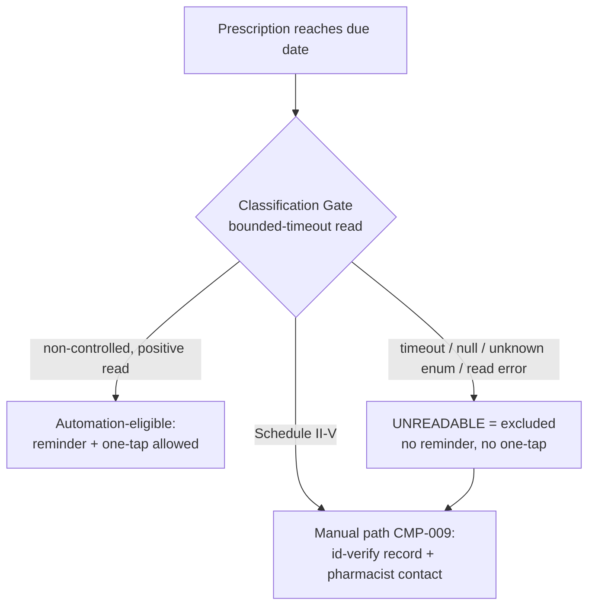
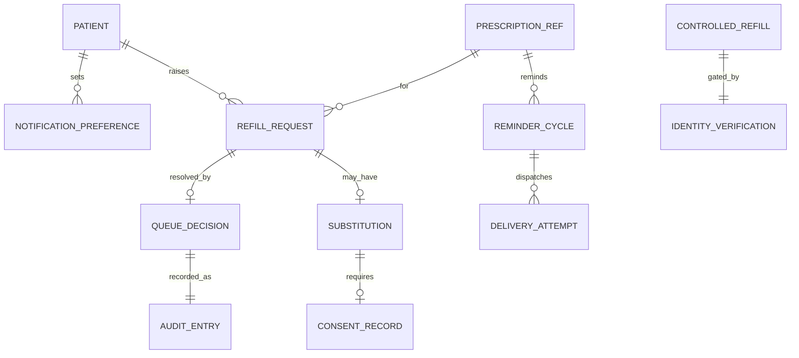

# SDD: MedRemind — Prescription Refill Reminder & Approval Module (DOC-002 §Design)

*Author: `sdd-writer` (software architect) · phase: design · 2026-07-10 · run4*
*Upstream: `srs-writer` (`06-srs.md`), `frd-writer` (`05-frd.md`), `prd-writer` (`04-prd.md`), `urs-writer` (`03-urs.md`). Scope source of truth: `brief.md`.*
*Downstream: `backlog-manager`, `adr-writer`, `api-designer`, `data-modeler`, `rfc-facilitator`, `tsd-writer`, `security-reviewer`, `sre`, `architect`. RTM: `examples/medremind-fleet-eval/run4/RTM.md`.*
*Register id: this is the **SDD (design) section of DOC-002** — the Lean RFC that merges SRS + SDD + TSD (doc-strategy §3/§4). The SR-constraint layer is `srs-writer`'s section (`06-srs.md`); concrete versions, endpoint specs, cipher suites, and physical schemas are the `tsd-writer` / `api-designer` / `data-modeler` sections of the same RFC. Kept proportionally lean per CON-5 (6-week / 3-sprint clock).*

| Field | Value |
|---|---|
| Author | `sdd-writer` (software architect) |
| Status | Draft |
| Related PRD / FRD / SRS | `04-prd.md`, `05-frd.md`, `06-srs.md` |
| Altitude | High-Level Design (HLD) + selected LLD boundaries. Concrete tech versions, endpoint specs, cipher suites, DB schemas → `tsd-writer` / `data-modeler` / `api-designer`. |
| Last updated | 2026-07-10 |

## FLAG & assumptions (read first)

- **FLAG(solution-recon):** the `solution-recon-findings` input listed in this agent's contract was **not found on disk** and was **not routed** by `build_context_pack.py` for run4 (the pack marked it *"not found — flag the missing handoff before inventing its content"*). No build-vs-buy / existing-asset reconnaissance was consulted. This design leans heavily on **reusing** the existing estate (patient app, pharmacist portal, IdP, dispensing system, Firebase, Twilio) exactly as the brief/PRD/SRS direct, so the gap is **low-risk for the topology** — but a recon pass, if one exists, could revise SDD-ARC-001 (deployment shape) or the dispensing-read seam (ASSUMPTION-20). Proceeding on the brief as source of truth; tracked as ASSUMPTION-20 rather than invented.
- **FLAG(rfc-facilitator):** the `RFC` input listed in this agent's contract was **not found on disk / not routed** for run4. No cross-team architectural RFC was consulted. The four hard-to-reverse decisions here (SDD-ARC-001, SDD-ARC-002, SDD-ARC-003, SDD-ARC-004, SDD-ARC-005) are candidates for standalone ADRs via `adr-writer`; if an RFC process governs architecture at RxKart, they should be RFC'd before ratification.
- **FLAG(architect / compliance):** the Classification Gate (SDD-CMP-002) and the fail-closed data read (SDD-DAT-001) are fully specified in *behaviour* — but the **concrete DEA-schedule source-of-truth field, read mechanism, and timeout value** on the dispensing record remain unresolved upstream (ASSUMPTION-8, owner architect/compliance; URS §10 FLAG chain → PRD → FRD-CTRL-005 → SR-SEC-006). The gate's fail-closed contract holds regardless of how that field resolves. Owned by the TSD / DOC-004, not invented here.
- **ASSUMPTION-20** *(new; owner: architect / `data-modeler`)* — MedRemind holds only a **reference** to the dispensing system's prescription record plus the read DEA-schedule classification; it does not replicate the prescription. If the dispensing system cannot expose a low-latency read for the ≤5-min evaluation cycle (SR-PERF-001), a read-model/cache seam may be required — a TSD/architect decision, not assumed decided here.
- **ASSUMPTION-21** *(new; owner: `sre` / architect)* — the reminder-evaluation scheduler wakes on a short fixed interval comfortably inside the 5-min budget (SR-PERF-001); the exact cadence and the durable catch-up mechanism (SDD-ARC-005) for post-outage replay (SR-REL-002, ASSUMPTION-17) are TSD/SRE decisions.
- **Consumed, not owned (do not treat as decided):** ASSUMPTION-8 (DEA-classification source + identity-verification mechanism — architect/compliance/`security-reviewer`, DOC-004), ASSUMPTION-13 (08:00–20:00 send window — `ux-ui-designer`/compliance, OQ-7), ASSUMPTION-14 (fail-closed default — `security-reviewer`), ASSUMPTION-15 (≤5-min measured to provider-accepted handoff, ≥99%/month — PM/architect), ASSUMPTION-16 (≤50k sends/day — architect/`performance-engineer`), ASSUMPTION-17 (30-min post-outage catch-up — PM), ASSUMPTION-18 (15-min portal idle timeout — compliance), ASSUMPTION-19 (≥6-year audit retention — compliance), ASSUMPTION-11 (SMS consent/opt-out — compliance), ASSUMPTION-12 (in-app substitution acceptance — `ux-ui-designer`). Carried for chain integrity: ASSUMPTION-1, ASSUMPTION-2, ASSUMPTION-3, ASSUMPTION-4, ASSUMPTION-5, ASSUMPTION-6, ASSUMPTION-9, ASSUMPTION-10.

## Overview and goals

MedRemind is **not a new product** — it is a module that plugs into RxKart's existing estate (250k-MAU patient app, pharmacist web portal, existing IdP, existing dispensing system, existing Firebase). This SDD describes *how* the refill loop **remind → one-tap request → pharmacist triage/decision → (optional) substitution consent** is structured so that it satisfies the FRD's deterministic behaviour (`05-frd.md`) and the SRS's measurable constraints (`06-srs.md`), at architecture altitude.

Design goals, in priority order (from the PRD guardrails and the SRS budgets):

1. **The compliance guardrails are structural, not procedural.** The controlled-substance exclusion (SR-SEC-006, FRD-CTRL-001, FRD-CTRL-005) and PHI-minimisation in notifications (SR-PHI-001, SR-PHI-002, SR-INT-002, FRD-PHI-001, FRD-PHI-002, FRD-PHI-004) are each enforced at a **single un-bypassable choke point**, so no code path can leak.
2. **Fail closed on the controlled-substance read** (FRD-CTRL-005, ASSUMPTION-14) — the automation-eligible state is reachable *only* through a positively-read *non-controlled* classification; absent/unreadable ⇒ excluded.
3. **At-most-once effect** for reminders and refill requests (SR-DAT-001), and **exactly-one** pharmacist decision under concurrency (SR-DAT-002).
4. **Independent, redundant delivery** — push (Firebase) and SMS (Twilio) fail in isolation (FRD-RMD-007) while producing at most one logical reminder; retries stay inside the SLA window (SR-REL-001) and pace within the Twilio cap (SR-INT-001).
5. **Meet the NFR budgets on the existing footprint** — ≤5-min dispatch to provider handoff (SR-PERF-001, ASSUMPTION-15), <2 s queue p95 @ 500 concurrent (SR-PERF-002), 99.9% store-hours availability (SR-AVL-001), ≤50k sends/day (SR-CAP-001, ASSUMPTION-16).
6. **Ship the 3-sprint vertical slice first** (CON-5) without designing an architecture that blocks the deferred *Should*/*Could* stories (e.g. substitution).

Scope boundary carried from upstream: no payment/copay, no courier logistics, no net-new app/portal, no clinical decision support, controlled-substance automation is a **permanent Won't**; HIPAA + DEA/state-board only, **not** full 21 CFR Part 11 / GAMP (ASSUMPTION-6).

## Architecture decisions (summary index)

Each hard-to-reverse decision below is a candidate for a standalone ADR via `adr-writer` and linked here; this section is the index, not the full rationale (see FLAG(rfc-facilitator)).

| ID | Decision | Chosen approach | Rejected alternatives | Rationale |
|---|---|---|---|---|
| SDD-ARC-001 | Deployment shape | A **modular service** deployed alongside the existing RxKart estate, exposing a patient BFF surface and a pharmacist portal surface; internally a small set of collaborating services (evaluation, notification, request, queue, audit) over a shared operational store. | (a) Full microservice fleet — rejected: team of 7, 3-sprint slice (CON-5); ops overhead unjustified at this scale. (b) Logic bolted inside the existing app monolith — rejected: the reminder evaluator is a scheduled/async workload with a different scaling and failure profile from the request/response surfaces. | Smallest structure that lets the async reminder pipeline scale and fail in isolation from the synchronous request/queue surfaces, without a fleet's operational cost. |
| SDD-ARC-002 | Compliance choke points | **Two mandatory in-line gates** every automation path must traverse: a **Classification Gate** (SDD-CMP-002) and a **PHI-Minimisation Boundary** (SDD-SEC-002). No path to dispatch or to a one-tap affordance exists that bypasses either. | Scattering the checks into each feature's business logic — rejected: a single missed check is a DEA or HIPAA violation (the PRD zero-violation guardrail), so the guard must be un-bypassable by construction, not by developer discipline. | Makes the two non-negotiable guardrails a property of the topology, not of every developer remembering them. |
| SDD-ARC-003 | Reminder pipeline style | **Event-driven, idempotent dispatch**: the evaluator emits one *ReminderDue* event per prescription per due-cycle; a dispatcher fans it to independent channel adapters, keyed by an idempotency ledger (prescription + refill-due cycle). | Synchronous per-prescription send inside the scheduler — rejected: couples channel latency/failure to the evaluation cycle and makes channel isolation (FRD-RMD-007), in-window retry (SR-REL-001), Twilio pacing (SR-INT-001), and at-most-once (SR-DAT-001) hard to guarantee. | Decouples evaluation from delivery so a Twilio/Firebase failure is contained, retries are safe, and the ≤5-min budget applies to the evaluation→handoff segment only. |
| SDD-ARC-004 | Audit & consent persistence | An **append-only** audit/consent store, logically separate from mutable operational state, is the system of record for pharmacist decisions (SR-AUD-001) and substitution consent (FRD-SUB-004); each audit write commits **in the same transaction** as the event it records (SR-AUD-002), via a transactional-outbox/write-once pattern. | Storing decisions as mutable columns on the request row — rejected: not tamper-evident, cannot satisfy attributable append-only retention (SR-AUD-003, ≥6 years). | Attributable, timestamped, append-only with same-transaction commit is a hard compliance constraint; a separate write-once log is the cleanest structural guarantee. |
| SDD-ARC-005 | Post-outage catch-up | A **durable scheduled-send / catch-up ledger** holds every eligible-but-undelivered reminder so that sends missed during an outage are replayed within 30 min of restoration (SR-REL-002, ASSUMPTION-17), without double-sending (SR-DAT-001). | Best-effort fire-and-forget with no durable record — rejected: an outage would silently drop the reminder and violate BR-NFR-001's intent. | Durability + the idempotency key make recovery replay-safe and bounded; cadence/mechanism is TSD/SRE (ASSUMPTION-21). |

## High-level architecture

**Narrative.** The existing **patient app** and **pharmacist portal** talk to MedRemind through a thin **BFF/API layer** (SDD-CMP-011) that delegates authentication to the **existing IdP** (no new auth platform) and enforces server-side, store-scoped authorization. The **Reminder Evaluation & Scheduler Service** (SDD-CMP-001) wakes on a short interval, reads due prescriptions from the **existing dispensing system**, and — before anything else — passes every candidate through the **Classification Gate** (SDD-CMP-002). Only a *positively-non-controlled* candidate inside the 08:00–20:00 send window becomes a *ReminderDue* event; it flows through the **Notification Composer** (SDD-CMP-003, the PHI boundary) to independent **Push (Firebase)** and **SMS (Twilio)** adapters (SDD-CMP-004), honouring the patient's opt-out (SDD-CMP-010). Patient taps resolve through the **Refill Request Service** (SDD-CMP-005, one open request per Rx). Pharmacists work requests through the **Queue & Decision Service** (SDD-CMP-006), whose decisions and substitution consents land in the **append-only Audit/Consent Store** (SDD-CMP-008). Controlled-substance needs are routed off automation entirely to the **manual path** (SDD-CMP-009). **Observability** (SDD-CMP-012) emits the SLIs and the all-channel-failure alert.

### C4 L2 — Container / component view

*(L1 context is the "Existing RxKart estate" boundary vs. the patient / pharmacist / compliance-officer actors; folded into the L2 since the externals are the same. L4 code diagrams are deferred — not essential at this altitude.)*

## Component breakdown (building-block view)

| Component | ID | Responsibility | Key interactions |
|---|---|---|---|
| Reminder Evaluation & Scheduler | SDD-CMP-001 | Scheduled evaluation of due prescriptions; applies the eligibility predicate (active ∧ non-controlled ∧ due); enforces the cadence (one initial, one re-reminder at +48 h if no request, at most two per due-cycle) and the stop conditions (request exists / Rx inactive); holds an out-of-window due event to the next 08:00–20:00 open; writes the send/idempotency ledger per prescription+cycle. | Reads dispensing system; calls Classification Gate; emits *ReminderDue*; writes ledger in OPS; feeds catch-up (SDD-ARC-005). |
| Classification Gate | SDD-CMP-002 | Single choke point reading the authoritative DEA-schedule classification within a bounded timeout, returning exactly one of {non-controlled, controlled, unreadable}. **Unreadable ⇒ excluded** (fail closed); never returns "eligible" by default. | Reads the dispensing Rx record (ASSUMPTION-8 field); gates SDD-CMP-001 and the one-tap re-check in SDD-CMP-005. |
| Notification Composer | SDD-CMP-003 | The **PHI-minimisation boundary**: builds every outbound payload from neutral copy + an opaque deep link; no drug name / prescriber / diagnosis crosses into any push or SMS field, including the lock-screen preview. | Consumes *ReminderDue*; consults Preference (SDD-CMP-010); feeds channel adapters. |
| Channel Dispatch (Push + SMS adapters) | SDD-CMP-004 | Two independent adapters (Firebase push, Twilio SMS). Attempts SMS as fallback when push reports failure; retries the same channel up to 3 times inside the SLA window before declaring it failed; paces SMS within the Twilio messages-per-second cap, queueing excess; records provider delivery status per attempt; raises a delivery-failure event when every enabled channel fails. | Firebase / Twilio (CON-1); writes DeliveryAttempt to OPS; emits metrics + failure event to SDD-CMP-012. |
| Notification Preference | SDD-CMP-010 | Persists per-patient SMS opt-out (STOP-keyword / preference), consulted so an opted-out patient is skipped for SMS while push is unaffected. | BFF; OPS; read by SDD-CMP-003/-004. |
| Refill Request Service | SDD-CMP-005 | Creates a refill request from a single confirm action; performs a **tap-time re-check** through the Classification Gate + active/expiry so a controlled or inactive Rx offers no one-tap; enforces one open request per prescription (idempotent — a repeat confirm is a no-op showing existing status). | BFF (patient); Classification Gate; OPS; feeds the queue. |
| Queue & Decision Service | SDD-CMP-006 | Serves the pending queue **scoped to the pharmacist's affiliated store**; records approve/reject with **exactly-one-decision** concurrency control (first commit wins, second rejected as already-decided); requires a non-empty reject reason; renders an explicit empty state; attributes every decision to an individually authenticated pharmacist. | BFF (pharmacist); OPS read projection (SDD-NFR-002); AUD write (SDD-CMP-008). |
| Substitution & Consent Service | SDD-CMP-007 | Attaches one pharmacist-suggested generic to a request; surfaces it in-app for accept/decline; blocks dispensing of the substituted item until a timestamped patient acceptance is recorded; keeps the original prescribed item as the dispensing basis on decline/no-response. | BFF; AUD (consent record); OPS. |
| Audit / Consent Store | SDD-CMP-008 | Append-only, attributable, UTC-timestamped system of record for pharmacist decisions and substitution consent; each record committed in the same transaction as its event; retained ≥6 years; queryable by request id / pharmacist id / date range; no mutation path through any surface. | Written by SDD-CMP-006/-007; read by audit/inspection. |
| Controlled-substance manual path | SDD-CMP-009 | The **alternative** surface a controlled-substance need is routed to: records a successful identity verification before the refill proceeds, then pharmacist-initiated contact — no automated fulfilment affordance anywhere on it. Verification *mechanism* is DOC-004-owned (ASSUMPTION-8); this component owns only the gate + record. | BFF; shares **no code path** with the automated pipeline; writes IdentityVerification record. |
| API / BFF layer | SDD-CMP-011 | Patient and pharmacist façades; delegates authN to the IdP; enforces server-side role/scope authZ (patient ⇒ own records; pharmacist ⇒ own store queue); terminates an idle pharmacist-portal session at 15 min. | App, Portal, IdP; fronts REQ/QUE/SUB/PREF/CTL. |
| Observability & Alerting | SDD-CMP-012 | Emits the three SLIs (reminder-delivery latency, queue-page latency, availability) sufficient to evaluate the NFRs monthly; raises an operational alert to on-call SRE on an all-channel reminder-delivery failure. | Consumes metrics from all services; alerting to SRE. |

## Data flow

### Runtime view — reminder → one-tap request → approval (happy path)

### Runtime view — fail-closed classification (highest-risk path)

This diagram is the structural expression of FRD-CTRL-001, FRD-CTRL-005, and SR-SEC-006: **there is no edge from *unreadable* to *automation-eligible*.**

## Conceptual data model

Conceptual entities and relationships only — physical schema, indexes, and column types are `data-modeler` / `tsd-writer`-owned.

| Entity | ID | Nature | Notes |
|---|---|---|---|
| Prescription reference | SDD-DAT-001 | **External, read-only** | Owned by the dispensing system; MedRemind holds a reference + the read DEA-schedule classification (ASSUMPTION-8, ASSUMPTION-20). Never originates prescriptions. The classification read is the fail-closed input to SDD-CMP-002. |
| ReminderCycle / send ledger | SDD-DAT-002 | Operational idempotency + cadence ledger | Key = prescription + refill-due cycle; tracks reminder count (≤2), state, next-window hold, and the at-most-once guarantee backing SR-DAT-001 and cadence (FRD-RMD-001, FRD-RMD-002, FRD-RMD-003, FRD-RMD-005). |
| RefillRequest | SDD-DAT-003 | Operational, mutable state machine | States: *received → pending → {approved, rejected, substitution-pending} → closed*. Unique open per prescription to enforce idempotency (SR-DAT-001, FRD-RFL-002). |
| QueueDecision | SDD-DAT-004 | **Append-only, attributable** | Approve/reject, acting pharmacist identity, UTC timestamp; reject carries a mandatory reason. Exactly one per request (SR-DAT-002, FRD-QUE-007). |
| Substitution + ConsentRecord | SDD-DAT-005 | Operational suggestion + **append-only consent** | Pharmacist suggestion; patient acceptance timestamp is the dispensing precondition (FRD-SUB-003, FRD-SUB-004). |
| AuditEntry | SDD-DAT-006 | **Append-only, retained** | System of record committed with its event (SR-AUD-002); no mutation path (SR-AUD-001); retained ≥6 years (SR-AUD-003); queryable by request id / pharmacist id / date range (SR-AUD-004). |
| DeliveryAttempt | SDD-DAT-007 | Operational | Per send attempt: channel, provider-accepted/failed status, timestamp (SR-INT-003); the data behind the all-channel-failure event (FRD-RMD-008). |
| NotificationPreference | SDD-DAT-008 | Operational | Per-patient SMS opt-out, persisted across cycles (FRD-RMD-006, ASSUMPTION-11). |
| IdentityVerification record | SDD-DAT-009 | **Append-only gate record** | Records a successful identity verification against a controlled-substance refill before it proceeds on the manual path (SR-SEC-006, FRD-CTRL-004). Mechanism DOC-004-owned. |

## API / interface overview

Logical interfaces only — resource names and purpose, not final endpoint specs (those are `api-designer` / `tsd-writer`).

- **Patient BFF:** resolve reminder deep-link → in-app prescription-eligibility view (the only place the drug is revealed, FRD-PHI-003); create refill request (idempotent); read request status; read/update notification preference (opt-out); enter the controlled-substance manual path; view + accept/decline a suggested substitution.
- **Pharmacist BFF:** read store-scoped pending queue; submit decision (approve / reject-with-reason); attach a suggested generic substitution.
- **Internal:** Evaluation → Classification Gate (classify); Evaluation → Composer (compose+dispatch); Composer → channel adapters (send); Queue/Substitution → Audit store (append in-txn).
- **External (integration seams):** IdP (authN; identity verification for the manual path, ASSUMPTION-8); dispensing system (prescription + DEA-schedule read, ASSUMPTION-20); Firebase (push); Twilio (SMS, under an executed BAA, SR-PHI-003) — all per CON-1.

## Non-functional design

| NFR (SRS) | Design element | ID | How the design meets it |
|---|---|---|---|
| ≤5-min dispatch to provider handoff, ≥99%/mo (SR-PERF-001, ASSUMPTION-15); ≤50k sends/day (SR-CAP-001, ASSUMPTION-16) | Async event-driven pipeline (SDD-ARC-003): the evaluation cycle emits *ReminderDue* and returns; dispatch is decoupled, horizontally scalable, and measured to provider-accepted handoff. Scheduler wakes on a short sub-budget interval (ASSUMPTION-21). | SDD-NFR-001 | Evaluation is never blocked by channel latency; the ≤5-min budget covers only the eligible-fire → provider-handoff segment; 50k/day is a batched-fan-out workload the adapters scale to. |
| Queue p95 <2 s @ 500 concurrent (SR-PERF-002) | A **read-optimised queue projection** (pre-computed pending view indexed by store) separate from the decision write path; the request-ack is a single idempotent write. | SDD-NFR-002 | Reads do not contend with decision writes; 40-store / 500-session concurrency is served from the projection, not the transactional path. |
| 99.9% store-hours availability (SR-AVL-001); in-window retry (SR-REL-001); post-outage catch-up (SR-REL-002) | Stateless request/queue services behind the existing platform HA; two independent channel adapters; ≤3 in-window retries per channel; a durable catch-up ledger (SDD-ARC-005) replays outage-missed sends within 30 min, idempotency-keyed so replay cannot double-send. | SDD-NFR-003 | A single-provider outage still delivers the other channel; failover replay is safe (SR-DAT-001); store-hours window per ASSUMPTION-4. |
| Observability of the SLOs (SR-OBS-001, SR-OBS-002) | Per-channel dispatch, delivery-outcome, and latency metrics emitted by SDD-CMP-004; three SLIs live at go-live; an all-channel-failure alert to on-call SRE; the notification pipeline (the riskiest surface) gets first-class metrics and a documented rollback path. | SDD-NFR-004 | The pipeline's failure is observable and paged; SLIs are sufficient to evaluate SR-PERF-001, SR-PERF-002, SR-AVL-001 monthly. |

## Security considerations

| Concern | Design element | ID | Notes |
|---|---|---|---|
| AuthN / AuthZ / session | All access via BFF → existing IdP (no new platform); server-side role/scope enforcement (patient ⇒ own records; pharmacist ⇒ own affiliated-store queue, 0 cross-store rows); every decision attributed to an individually authenticated pharmacist; idle pharmacist session terminated at 15 min. | SDD-SEC-001 | SR-SEC-003, SR-SEC-004, SR-SEC-005. Authorization is never client-trusted; shared/service accounts are not accepted for decision actions. |
| PHI-minimisation boundary | The Notification Composer is the **only** component that produces outbound patient payloads, constructed to carry **no PHI** — neutral copy + an opaque deep link; the drug/prescription detail is resolved **only inside the authenticated app**, never in a push preview or SMS body. FCM payloads are PHI-free because FCM has no HIPAA BAA. | SDD-SEC-002 | SR-PHI-001, SR-PHI-002, SR-INT-002, FRD-PHI-001, FRD-PHI-002, FRD-PHI-004. The shared/insecure-device threat (URS §3) is defeated by structure: PHI never leaves the authenticated boundary. |
| Encryption, BAA, trust boundaries | PHI encrypted in transit (TLS 1.2 minimum) on every external interface and at rest (AES-256 minimum); production SMS only under an executed Twilio BAA; trust boundaries drawn at the BFF (external↔internal) and at each external seam (IdP, dispensing, Firebase, Twilio). | SDD-SEC-003 | SR-SEC-001, SR-SEC-002, SR-PHI-003. Exact cipher suite + key management are TSD / security-review-owned. The BAA may require a paid Twilio edition — a cost item flagged to PM (SRS feedback loop). |
| Controlled-substance safety | The manual path (SDD-CMP-009) shares **no code** with the automated pipeline, so no reachable state automates a controlled substance; a controlled refill proceeds only after a successful identity verification is recorded; fail-closed on unreadable classification. | SDD-SEC-004 | SR-SEC-006, FRD-CTRL-003, FRD-CTRL-004, CON-3. Verification mechanism is DOC-004-owned (ASSUMPTION-8). |

**Threat notes (STRIDE-informed):** *Information disclosure* — mitigated structurally by SDD-SEC-002 (no PHI in notifications). *Tampering / Repudiation* — mitigated by the append-only, same-transaction attributable audit store (SDD-ARC-004). *Elevation of privilege* — mitigated by server-side store-scoped authZ (SDD-SEC-001). *Spoofing* — IdP-delegated auth + manual-path identity verification (SDD-SEC-001, SDD-SEC-004). A full threat model (DOC-004) is owned by `security-reviewer` — this SDD hands off the trust boundaries and the two choke points to it.

## Build-slice shaping (design → the seeded PBIs)

The `frd-writer` pull order (`05-frd.md` §Seeded PBIs) ranks the two hard guardrails first. This design keeps them cheap to land because each is a single component:

- **Sprint 1 (guardrails first):** `PBI-CTRL-001`, `PBI-CTRL-002` (Classification Gate SDD-CMP-002 + fail-closed read SDD-DAT-001 + one-tap re-check in SDD-CMP-005) and `PBI-PHI-001` (Composer boundary SDD-SEC-002 / SDD-CMP-003). These are the un-bypassable choke points (SDD-ARC-002) and must exist before any reminder or one-tap ships.
- **Sprint 2 (funnel core):** `PBI-RMD-001` (SDD-CMP-001 + SDD-DAT-002 + SDD-ARC-003), `PBI-RFL-001` (SDD-CMP-005 + SDD-DAT-003), `PBI-QUE-001` (SDD-CMP-006 + SDD-NFR-002), `PBI-RMD-002` (SDD-CMP-004 fallback/retry + SDD-DAT-007).
- **Sprint 3 (audited decisions + safety completion):** `PBI-QUE-002` (SDD-CMP-006 + SDD-CMP-008 + SDD-ARC-004), `PBI-QUE-003` (SR-DAT-002 concurrency in SDD-CMP-006 / SDD-DAT-004), `PBI-CTRL-003` (manual path SDD-CMP-009 + SDD-DAT-009), and — if the clock allows — the *Should*-priority substitution pair `PBI-SUB-002` then `PBI-SUB-001` (SDD-CMP-007 + SDD-DAT-005).

`backlog-manager` owns the final ranking against sprint capacity; every PBI named here has its defining, AC-bearing row in `05-frd.md` §Seeded PBIs (no phantom PBIs introduced by this SDD).

## Reality-check loop (feedback upstream)

Designing this surfaced **no architecturally impossible** PRD/SRS requirement — the NFR budgets are achievable on the existing footprint with the decoupled pipeline. Items that are **design-blocked pending ratification**, flagged rather than silently absorbed:

- To **`architect` / `tsd-writer`** — SR-REL-001 (≤3 in-window retries) and SR-INT-001 (Twilio pacing) together bound the dispatcher inside the 5-min budget (SDD-CMP-004 / SDD-ARC-003); the dispensing-read latency (ASSUMPTION-20) and scheduler cadence (ASSUMPTION-21) must be pinned in the TSD or a read-model seam added.
- To **`security-reviewer` (DOC-004)** — confirm the identity-verification *mechanism* (ASSUMPTION-8) behind SDD-CMP-009/SDD-DAT-009 and ratify the fail-closed default (ASSUMPTION-14) before `PBI-CTRL-003` clears DoR; SDD-SEC-002 hands you the PHI trust boundary.
- To **`prd-writer` / PM** — the Twilio BAA (SR-PHI-003) may force a paid Twilio edition (cost/scope item against the BRD budget); the send-window (ASSUMPTION-13, OQ-7) sets SDD-CMP-001's hold behaviour and is still un-owned upstream.

## Key trade-offs and decisions

| Decision | Chosen approach | Alternatives rejected | Rationale |
|---|---|---|---|
| Guardrails in topology vs. logic | Two mandatory in-line gates (SDD-ARC-002) | Per-feature checks | A missed check is a DEA/HIPAA violation; make it un-bypassable by construction. |
| Reminder pipeline | Event-driven + idempotency ledger (SDD-ARC-003) | Synchronous per-Rx send | Contains provider failure; enables safe in-window retry, Twilio pacing, and channel redundancy. |
| Audit persistence | Separate append-only store, same-txn commit (SDD-ARC-004) | Mutable columns on the request | Tamper-evident, attributable, ≥6-year retention-ready, no unrecorded events. |
| PHI defence | Resolve PHI only inside the authenticated app (SDD-SEC-002) | Encrypt-but-include a reference token in the payload | Even an opaque token in an SMS is a real surface; carrying *nothing* is the strongest guarantee for the shared-device threat. |
| Post-outage delivery | Durable catch-up ledger, replay within 30 min (SDD-ARC-005) | Fire-and-forget | An outage would otherwise silently drop reminders; idempotency key makes replay double-send-safe. |
| Deployment shape | Modular service on the existing estate (SDD-ARC-001) | Microservice fleet | Team of 7 / 3-sprint slice; fleet ops cost unjustified. |

## Requirements traceability

Design elements → the SRS / FRD / PRD requirements they satisfy (rows also appended to `RTM.md`).

| SRS / FRD / PRD requirement | Addressed by (SDD) |
|---|---|
| FRD-CTRL-001, FRD-CTRL-005, SR-SEC-006 (fail-closed exclusion) | SDD-ARC-002, SDD-CMP-002, SDD-DAT-001 |
| FRD-CTRL-002 (never one-tap a controlled) | SDD-CMP-002, SDD-CMP-005 |
| FRD-CTRL-003, FRD-CTRL-004 (manual path + id-verify record) | SDD-CMP-009, SDD-SEC-004, SDD-DAT-009 |
| SR-DAT-001, FRD-RFL-002, FRD-RMD-003 (at-most-once / idempotency) | SDD-ARC-003, SDD-CMP-001, SDD-CMP-005, SDD-DAT-002, SDD-DAT-003 |
| SR-DAT-002, FRD-QUE-007 (exactly-one decision) | SDD-CMP-006, SDD-DAT-004 |
| FRD-RMD-001, FRD-RMD-002, FRD-RMD-004, FRD-RMD-005 (cadence + stop conditions) | SDD-CMP-001, SDD-DAT-002 |
| FRD-RMD-006 (SMS opt-out) | SDD-CMP-010, SDD-DAT-008 |
| FRD-RMD-007, SR-REL-001, SR-INT-001 (fallback, in-window retry, Twilio pacing) | SDD-CMP-004, SDD-ARC-003 |
| FRD-RMD-008, SR-INT-003, SR-OBS-002 (delivery status + all-channel-fail alert) | SDD-CMP-004, SDD-CMP-012, SDD-DAT-007 |
| SR-REL-002 (post-outage catch-up) | SDD-ARC-005, SDD-CMP-001, SDD-NFR-003 |
| SR-PHI-001, SR-PHI-002, SR-INT-002, FRD-PHI-001, FRD-PHI-002, FRD-PHI-004 (PHI minimisation) | SDD-SEC-002, SDD-CMP-003 |
| FRD-PHI-003 (drug revealed only in-app) | SDD-SEC-002, SDD-CMP-011 |
| FRD-RFL-001, FRD-RFL-003 (one-tap + tap-time re-check) | SDD-CMP-005, SDD-CMP-011 |
| FRD-QUE-001, FRD-QUE-002 (store-scoped queue + empty state) | SDD-CMP-006, SDD-NFR-002, SDD-SEC-001 |
| FRD-QUE-003, FRD-QUE-004, FRD-QUE-005, FRD-QUE-006, SR-AUD-001, SR-AUD-002 (audited reasoned decisions) | SDD-CMP-006, SDD-CMP-008, SDD-ARC-004, SDD-DAT-004, SDD-DAT-006 |
| SR-AUD-003, SR-AUD-004 (retention + queryability) | SDD-CMP-008, SDD-DAT-006 |
| FRD-SUB-001, FRD-SUB-002, FRD-SUB-003, FRD-SUB-004, FRD-SUB-005 (substitution + consent gate) | SDD-CMP-007, SDD-CMP-008, SDD-DAT-005 |
| SR-SEC-001, SR-SEC-002, SR-PHI-003 (encryption + BAA) | SDD-SEC-003 |
| SR-SEC-003, SR-SEC-004, SR-SEC-005 (authZ, attribution, idle timeout) | SDD-SEC-001, SDD-CMP-011, SDD-CMP-006 |
| SR-PERF-001, SR-CAP-001 (≤5-min dispatch, ≤50k/day) | SDD-NFR-001, SDD-ARC-003, SDD-CMP-001 |
| SR-PERF-002 (queue <2 s @ 500) | SDD-NFR-002, SDD-CMP-006 |
| SR-AVL-001 (99.9% store-hours) | SDD-NFR-003 |
| SR-OBS-001 (SLIs live) | SDD-NFR-004, SDD-CMP-012 |

## Open questions

| Question | Owner | Decision | Date |
|---|---|---|---|
| Concrete DEA-schedule source-of-truth field, read mechanism, timeout on the dispensing record | architect / compliance (DOC-004) | Open — ASSUMPTION-8 (see FLAG) | — |
| Whether a dispensing-system read-model/cache seam is needed for the ≤5-min eval cycle | architect / `data-modeler` | Open — ASSUMPTION-20 | — |
| Scheduler wake cadence + durable catch-up mechanism within the 5-min budget | `sre` / architect | Open — ASSUMPTION-21 | — |
| Identity-verification mechanism behind the manual-path gate | `security-reviewer` (DOC-004) | Open — ASSUMPTION-8 | — |
| Send-window (08:00–20:00) ownership + ratification | `ux-ui-designer` / compliance | Open — ASSUMPTION-13 / OQ-7 | — |

## Requirement-quality note (29148/INCOSE lint)

SDD design-element IDs (SDD-ARC-*, SDD-CMP-*, SDD-DAT-*, SDD-SEC-*, SDD-NFR-*) describe *structure and responsibility*, not "the system shall" obligations — the FRD (`05-frd.md`) and SRS (`06-srs.md`) own the testable requirement statements this design satisfies. All SDD IDs are atomic; no range shorthand is used. Any `validate_reqs.py` findings on non-SDD IDs appearing here are upstream FRD-*/SR-*/PRD-*/URS-* IDs *cited* in trace columns, owned by their authoring agents.
