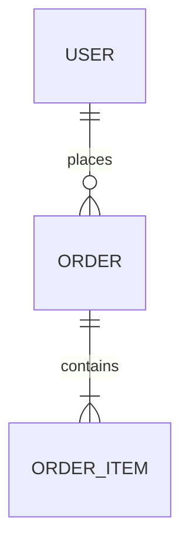

# Data Model — <domain / feature>

| Field | Value |
|---|---|
| Author | <data-modeler / architect> |
| Related | <SDD / FRD / SRS> |

## ERD

## Entities (logical)

| Entity | Key | Key attributes | Relationships |
|---|---|---|---|
| | | | |

## Physical schema

| Table | Column | Type | Constraints | Index |
|---|---|---|---|---|
| | | | | |

## Access patterns → indexes

| Query (filter / join / sort) | Index |
|---|---|
| | |

## Datastore choice

<SQL / NoSQL + rationale vs SRS targets>

## Migrations

| Version | Change | Rollback | Zero-downtime plan |
|---|---|---|---|
| | | | |
