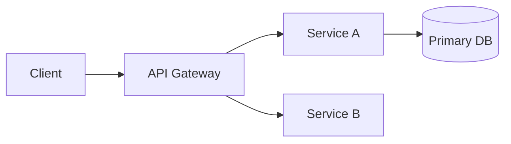

# SDD: <System / Project Name>

| Field | Value |
|---|---|
| Author | <architect> |
| Status | Draft |
| Related PRD | <link> |
| Last updated | <date> |

## Overview and goals

<What this system does and the design goals/constraints driving it.>

## High-level architecture

<Narrative + component diagram.>

## Component breakdown

| Component | Responsibility | Key interactions |
|---|---|---|
| | | |

## Data flow

<Describe critical flows; include a sequence or flow diagram for the most important one.>

## Conceptual data model

<Main entities and relationships — conceptual, not physical schema.>

## API / interface overview

<Logical interfaces between components — resource names and purpose, not final endpoint specs.>

## Non-functional design

<How the design meets performance, scalability, availability, and security targets.>

## Security considerations

<Authn/authz model, trust boundaries, data protection, threat notes.>

## Key trade-offs and decisions

| Decision | Chosen approach | Alternatives rejected | Rationale |
|---|---|---|---|
| | | | |

## Requirements traceability

| PRD requirement | Addressed by |
|---|---|
| | |

## Open questions

| Question | Owner | Decision | Date |
|---|---|---|---|
| | | | |
